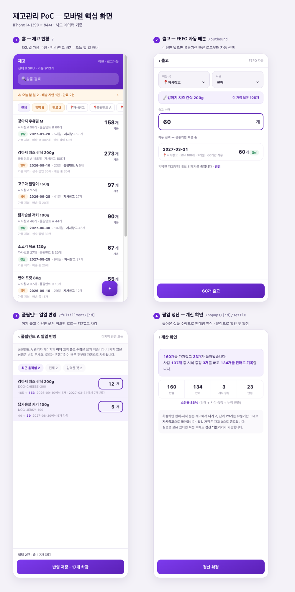

# 재고관리 PoC — 강아지 간식

[](https://github.com/overpassion/inventory-poc/actions/workflows/verify.yml)
[](https://github.com/overpassion/inventory-poc/commits)


**풀필먼트**(물류 일괄 대행 서비스) 3사와 자사창고에 흩어진 재고를 **유통기한 단위(로트)** 로 관리하고,
오프라인 팝업 반출·정산까지 추적하는 사내 재고관리 앱.

강의·시연용 PoC이지만 **상용 제품의 골격**을 갖추는 것을 목표로 한다.

---

## 화면

모바일 핵심 화면 4개 — 홈 · 출고(FEFO) · 풀필먼트 일일 반영 · 팝업 정산



---

## 실행

```bash
git clone https://github.com/jo-narae/inventory-poc.git && cd inventory-poc
npm install
cp .env.example .env   # SESSION_SECRET 을 아무 긴 문자열로 바꾼다
npm run dev            # DB가 없으면 자동으로 만들고 목업 데이터까지 넣는다
```

http://localhost:3000

| 계정 | 이름 | 비밀번호 |
|---|---|---|
| `warehouse@demo.kr` | 이현 (물류창고) | `demo1234` |
| `sales@demo.kr` | 민수 (영업) | `demo1234` |

## 명령어

```bash
npm run dev          # 개발 서버 (DB 없으면 migrate + seed 자동)
npm run seed         # 목업 데이터 다시 채우기
npm run seed:reset   # DB 파일을 지우고 처음부터 (시연 중 초기화, 5초)
npm run db:studio    # 브라우저로 DB 테이블 열기 (localhost:5555)
npm test             # 자동 테스트
npm run build        # 프로덕션 빌드
```

> `seed:reset`을 해도 사용자·상품 ID가 1번부터 다시 부여되므로,
> 열어둔 화면의 링크와 로그인 세션이 그대로 살아 있다.

## 백업과 복구

DB는 **`prisma/dev.db` 파일 하나**다. 백업은 이 파일을 복사하는 것이고, 복구는 되돌려 놓는 것이다.

**언제 뜨는가** — 실사 조정처럼 되돌리기 어려운 작업 전, 시연 직전, 여러 사람이 만지기 전.

### 백업

```bash
# 1) 서버를 멈춘다 (Ctrl+C)  ← 이 단계를 건너뛰지 않는다
# 2) 복사한다
cp prisma/dev.db "backup/dev-$(date +%Y%m%d-%H%M).db"
```

**서버를 켠 채로 복사하면 안 된다.** 쓰는 중에 복사하면 절반만 기록된 상태가 그대로 백업된다. 겉보기엔 멀쩡한 파일이 나오고, 복구할 때가 되어서야 깨진 걸 알게 된다.

`dev.db-wal` · `dev.db-shm` · `dev.db-journal` 이 같이 보이면 **그것들도 함께 복사한다.** 아직 본 파일에 반영되지 않은 변경이 거기 들어 있을 수 있다. 서버를 제대로 멈췄다면 보통 남아 있지 않다.

`.env`도 함께 챙겨 두면 좋다. 잃어도 데이터는 무사하지만 `SESSION_SECRET`이 바뀌어 **모두 다시 로그인**해야 한다.

### 복구

```bash
# 1) 서버를 멈춘다
# 2) 형제 파일을 먼저 지운다 — 남아 있으면 옛 변경이 덮어쓴다
rm -f prisma/dev.db-wal prisma/dev.db-shm prisma/dev.db-journal
# 3) 되돌려 놓는다
cp "backup/dev-20260916-1430.db" prisma/dev.db
# 4) 서버를 켠다
npm run dev
```

### 처음부터 다시

백업이 없거나 데이터가 엉켰으면 **시드 상태로 되돌린다.** 백업이 아니라 초기화다 — 그동안 넣은 실제 데이터는 사라진다.

```bash
npm run seed:reset   # 5초
```

> ⚠️ **`backup/` 은 아직 `.gitignore` 에 없다.** 그대로 두면 DB 사본이 저장소에 커밋될 수 있다.
> 저장소 밖(예: `../inventory-backup/`)에 두거나, `.gitignore` 에 `/backup/` 을 먼저 추가하고 쓴다.

## 이 앱의 핵심 개념

**로트 = 상품 × 거점 × 유통기한.** 셋 중 하나라도 다르면 다른 재고다.

**풀필먼트 = 물류 일괄 대행 서비스.** 재고 보관·포장·출고를 대신 해주는 업체다.
우리가 맡기면 **그쪽이 세고 그쪽이 내보낸다** — 그래서 수치가 갈리면 **저쪽이 맞다**고 본다.

**재고는 사라지지 않고 이동한다.** 모든 수량 변화는 `어디 → 어디` 기록으로 남는다.
한쪽이 비어 있으면(외부) 그때만 총 재고가 변한다.

```
[외부] → 자사창고 → 배송 중 → 풀필먼트 → [외부]
              ↓
            팝업 → 판매 [외부] / 잔여는 자사창고 복귀
```

**배분 방향은 상황에 따라 반대다.**

| 동작 | 전략 | 이유 |
|---|---|---|
| 출고 · 풀필먼트 일일 반영 · 팝업 반출 | **FEFO** 임박분 먼저 | 곧 소비되므로 임박분부터 내보내야 안 버린다 |
| **풀필먼트 발송** | **LEFO** 넉넉한 분 먼저 | 도착 3~5일 + 판매 대기. 임박분을 보내면 팔리기 전에 만료된다 |

## 기술 스택

Next.js 16 (App Router) · TypeScript · Prisma 7 + SQLite · Tailwind CSS 4 · Vitest

- 상태관리 라이브러리 없음 — 서버 컴포넌트 + Server Actions
- 인증: 자체 세션 쿠키 (jose JWT + bcryptjs)
- DB는 `prisma/dev.db` 파일 하나. 커밋하지 않는다(마이그레이션과 시드로 재현)

## 문서

| 파일 | 내용 |
|---|---|
| [docs/HANDOVER.md](docs/HANDOVER.md) | **현재 진행 상황과 다음 할 일** |
| [docs/01-requirements.md](docs/01-requirements.md) | 요구사항 · 사유 체계 · 완료 기준 |
| [docs/02-personas.md](docs/02-personas.md) | 사용자 두 명과 설계 긴장점 |
| [docs/03-scenarios.md](docs/03-scenarios.md) | 시나리오 12개 · 설계 원칙 P1~P12 |
| [docs/04-engagement.md](docs/04-engagement.md) | 차별화 장치 E1~E3 |
| [docs/05-design.md](docs/05-design.md) | 컴포넌트 명세 · 색상 토큰 · 접근성 |
| [docs/06-architecture.md](docs/06-architecture.md) | 데이터 모델 · 핵심 로직 · 시드 설계 |
| [docs/07-plan.md](docs/07-plan.md) | 마일스톤 M1~M7 · QA 체크리스트 |
| `mockups/final.html` | 확정 디자인 시안 |
