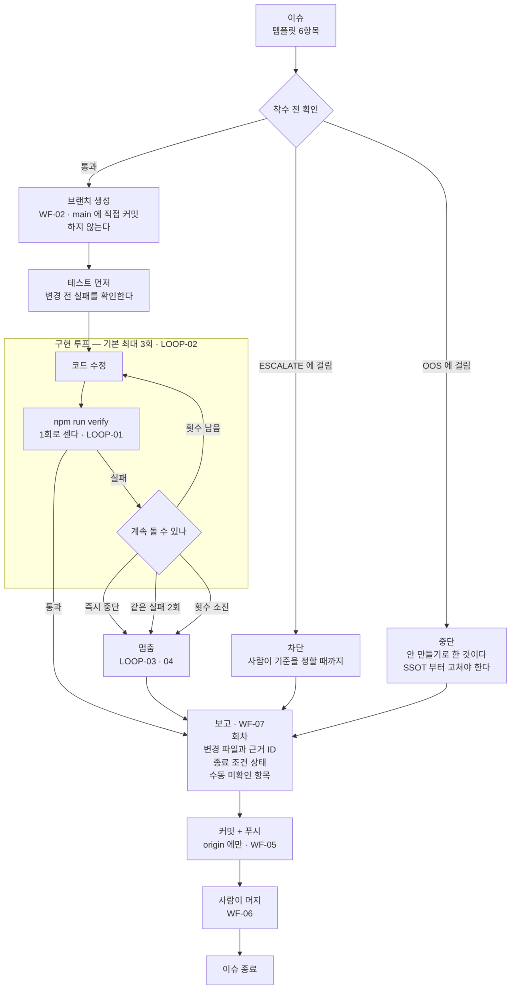
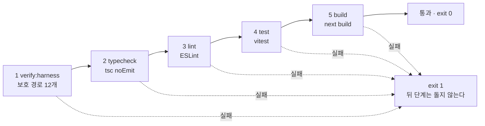
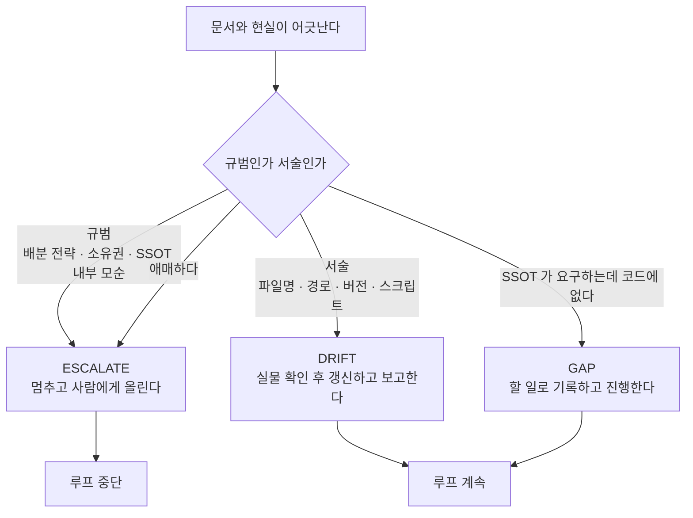
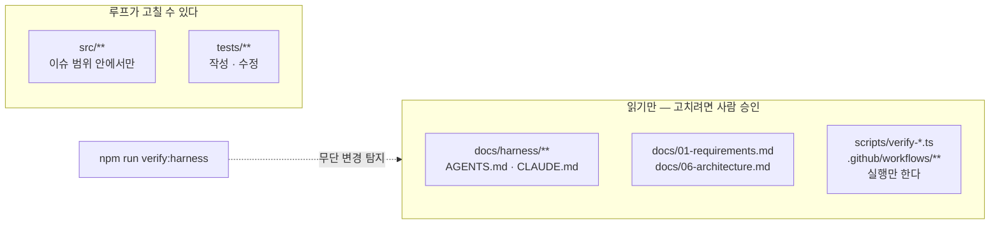

# 03-A. 루프 도식

> 작성일: 2026-09-16 · 기준 커밋: `f8ec201`
> [03-loop.md](./03-loop.md) 의 그림이다. **규칙 본문은 그쪽에만 있다** — 이 문서는 도식만 담는다.
> 그림과 본문이 다르면 [03-loop.md](./03-loop.md) 를 따른다.

---

## 1. 전체 흐름 — 이슈에서 머지까지

**읽는 법** — 실패든 성공이든 **모든 길이 `보고` 로 모인다.** 조용히 끝나는 경로가 없다.

---

## 2. `npm run verify` — 한 회차 안에서 도는 5단계

싼 것부터 비싼 것 순이다. 상세는 [02-verification.md](./02-verification.md).

---

## 3. 루프 중 어긋남을 발견하면

**애매하면 `ESCALATE`** — 서술로 잘못 분류해 규범을 지우는 쪽이 더 나쁘다. 분류 기준은 [01-ssot.md](./01-ssot.md) §0.5.

---

## 4. 루프가 건드릴 수 있는 것

권한 원본은 [01-ssot.md](./01-ssot.md) §0.6. **가드는 사후 탐지이지 사전 차단이 아니다** — 편집 자체를 막지는 못한다.
